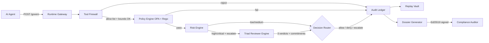
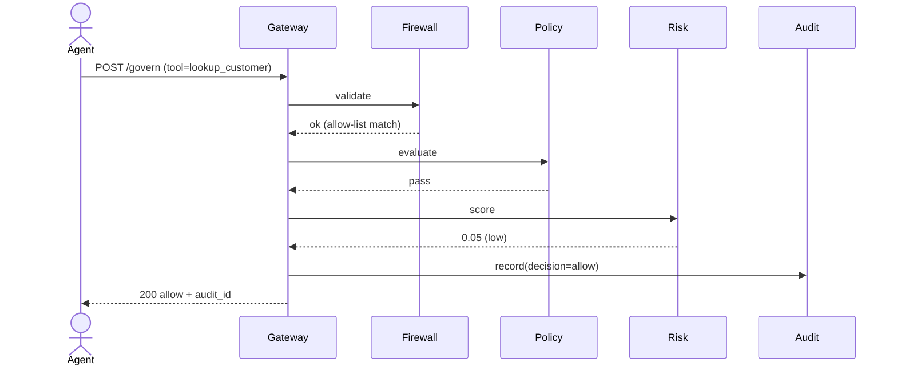
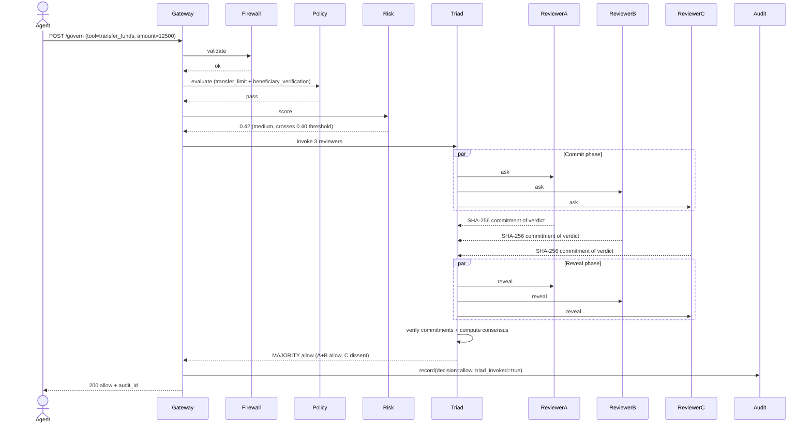
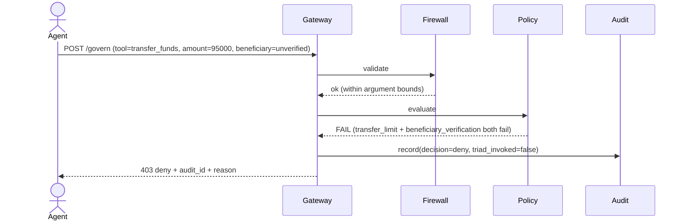
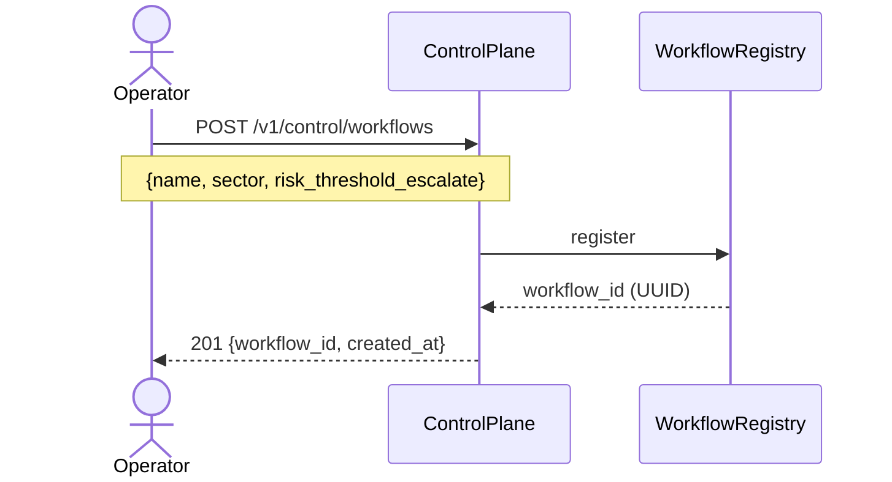
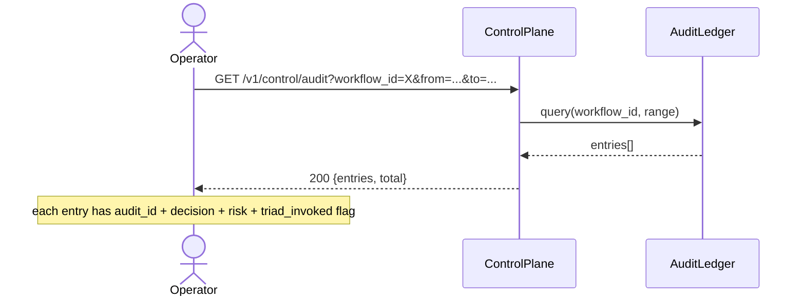
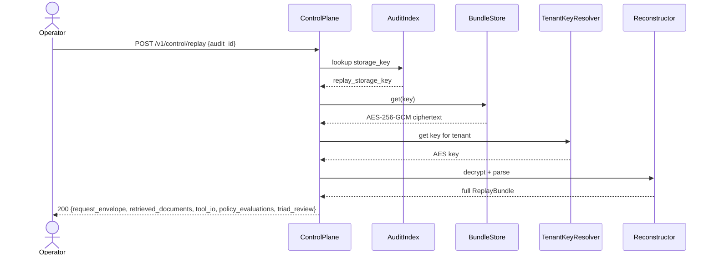
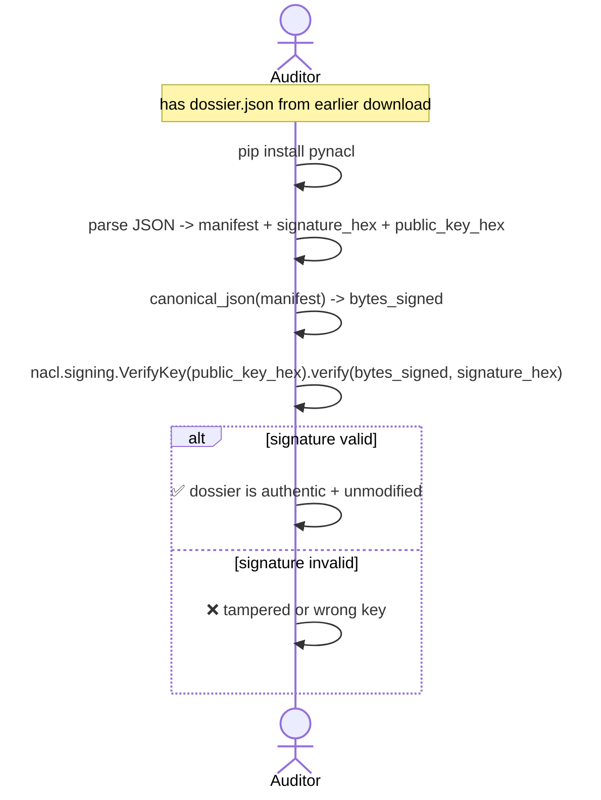

# Verixa — Use Cases & User Flows (Phase 0)

Every use case below is **backed by working code and at least one test**.
The seeded financial-services demo (CP-16) exercises every one of them on
container boot, so a judge can click through the entire catalogue without
any setup.

Use `https://vsenthil7-verixa-control-plane.hf.space/docs` as the live
surface while reading this; every UC has a matching *Try it out* button.

---

## Personas

| Persona | Who they are | What they do here |
|---|---|---|
| **Agent runtime** | An AI agent (or its host process) calling a tool to affect the real world | Sends `POST /govern` requests with action envelopes; receives allow / deny / escalate decisions |
| **Platform operator** | Security or platform team running Verixa for a tenant | Registers workflows + agents + tools; reviews the audit log; investigates incidents |
| **Compliance auditor** | External or internal reviewer asking "what happened on date X" | Reads dossiers, verifies Ed25519 signatures offline, never depends on Verixa's live state |
| **Reviewer triad** | Three independent LLM reviewers consulted on high-risk actions | Each produces a verdict + a SHA-256 commitment of that verdict before revelation; consensus is computed across the three |

---

## High-level system flow

---

## UC-01 — Low-risk read-only action (allow, no triad)

**Actor:** AI agent performing a low-risk lookup.

**Trigger:** Agent calls `read_customer_balance(customer_id)`.

**Seeded example:** Decision A in the demo seed (`demo_seed.py` audit_ids[0]).

**Flow:**

**Outcome:** Action is allowed. No triad invocation. Audit entry persisted with risk score 0.05. Reconstructible later via `POST /v1/control/replay`.

**Verified by:** `test_seed_creates_three_audit_entries` in `apps/control-plane-api/tests/test_demo_seed.py` + the dashboard's recent-decisions row covered by Playwright `apps/control-plane-ui/tests-e2e/dashboard.spec.ts`.

---

## UC-02 — Medium-risk transfer with triad consensus (allow)

**Actor:** AI agent attempting a USD 12,500 vendor transfer.

**Trigger:** Risk score crosses the workflow's `risk_threshold_escalate=0.40` boundary, triggering triad review.

**Seeded example:** Decision B (`demo_seed.py` audit_ids[1]).

**Flow:**

**Outcome:** Allowed by triad consensus. Three verdicts + three SHA-256 commitments persist in the replay bundle. The commit-reveal protocol means no reviewer can post-hoc adjust their verdict after seeing the others'.

**Verified by:** `test_seed_audit_b_is_the_triad_decision` + `test_seed_pre_generated_dossier_verifies_offline` in `apps/control-plane-api/tests/test_demo_seed.py` + the triad protocol invariants in `packages/verixa-python/tests/test_triad_orchestrator.py` + `test_triad_protocol.py` + `test_triad_reviewer.py` + 4 gated MI300X tests in `test_triad_integration.py`.

---

## UC-03 — Critical-risk policy denial (no triad needed)

**Actor:** AI agent attempting a USD 95,000 transfer to an unverified beneficiary.

**Trigger:** Policy evaluation fails *before* the risk engine runs — denial short-circuits.

**Seeded example:** Decision C (`demo_seed.py` audit_ids[2]).

**Flow:**

**Outcome:** Denied. Audit entry shows `triad_invoked=false` and two failed policy evaluations. Demonstrates that the system fails fast — no expensive triad call is made when policy already denies.

**Verified by:** `test_seed_audit_c_is_the_policy_deny` in `apps/control-plane-api/tests/test_demo_seed.py`.

---

## UC-04 — Workflow registration

**Actor:** Platform operator setting up Verixa for a new agent workflow.

**Trigger:** `POST /v1/control/workflows` with name, sector, risk threshold.

**Flow:**

**Outcome:** A new workflow exists. Agents and tools can now be registered under it.

**Verified by:** `test_workflow_register_handler` in `apps/control-plane-api/tests/test_registry.py`.

---

## UC-05 — Agent registration (with SPIFFE id)

**Actor:** Platform operator.

**Trigger:** `POST /v1/control/agents` with workflow id, SPIFFE id, role.

**Outcome:** An agent is registered under the workflow. Its SPIFFE id is recorded in every audit entry the agent generates. *Phase 0: SPIFFE id is stored but not validated against a SPIRE server; Phase 1 wires real SPIRE.*

**Verified by:** `test_agent_register_handler` in `apps/control-plane-api/tests/test_registry.py`.

---

## UC-06 — Tool registration (allow-list + arg bounds)

**Actor:** Platform operator.

**Trigger:** `POST /v1/control/tools` with name, allowed-args schema, optional `restrict_to_workflow`.

**Outcome:** The Tool Firewall now permits this tool when called by the right workflow with arguments inside bounds. A tool restricted to one workflow can't be called by another.

**Verified by:** `test_tool_register_handler` in `apps/control-plane-api/tests/test_registry.py` + `test_firewall_allowlist.py` + `test_firewall_arg_bounds.py` in `packages/verixa-python/tests/`.

---

## UC-07 — Audit log query (operator)

**Actor:** Platform operator investigating activity in a workflow.

**Trigger:** `GET /v1/control/audit?workflow_id=&from=&to=`.

**Flow:**

**Outcome:** Operator gets a time-windowed slice of governance decisions. Each entry has the metadata to drive a "view detail" or "generate dossier" follow-up.

**Verified by:** `test_audit_query_handler` in `apps/control-plane-api/tests/test_audit.py` + Playwright `apps/control-plane-ui/tests-e2e/audit.spec.ts` (4 specs).

---

## UC-08 — Decision replay (operator)

**Actor:** Platform operator investigating a specific decision.

**Trigger:** `POST /v1/control/replay` with `audit_id`.

**Flow:**

**Outcome:** Operator gets the entire decision context back — request, what the agent saw at decision time, every policy evaluation, every triad verdict + commitment. Snapshot-based, not bit-exact regeneration.

**Verified by:** `test_replay_handler` in `apps/control-plane-api/tests/test_handlers.py` + Playwright `apps/control-plane-ui/tests-e2e/decision-detail.spec.ts` (5 specs).

---

## UC-09 — Signed compliance dossier generation

**Actor:** Operator or auditor requesting an evidence pack for a specific decision.

**Trigger:** `POST /v1/control/dossier` with `audit_id` and optional `action_summary`.

**Outcome:** A `SignedDossier` is returned containing a manifest (cover + decision trail + evidence) and an Ed25519 signature over the canonical-JSON encoding of the manifest.

**Verified by:** `test_dossier_generate_handler` in `apps/control-plane-api/tests/test_handlers.py` + Playwright `apps/control-plane-ui/tests-e2e/dossier-viewer.spec.ts` (4 specs).

---

## UC-10 — Offline dossier verification (auditor)

**Actor:** Compliance auditor. **Critical property: Verixa is NOT in the trust path.**

**Trigger:** Auditor has the dossier JSON (downloaded earlier) and wants to confirm it's authentic.

**Flow:**

**Outcome:** The auditor verifies the signature with any standard Ed25519 library. No network call to Verixa. No trust in Verixa's running state. The dossier is **portable evidence**.

**Verified by:** `test_verify_signed_dossier_round_trip` in `packages/verixa-python/tests/test_dossier_manifest.py` + `test_audit_verify_cli.py` (covers the standalone `tools/audit_verify.py` verifier script end-to-end).

---

## What's NOT in Phase 0 (deferred)

The use cases below are in the longer roadmap but **not implemented in Phase 0**. They are surfaced here so a judge can see the deliberate scope:

| Use case | Phase | Why deferred |
|---|---|---|
| UC-11 Approval matrix (human-in-the-loop) | Phase 1 | Needs SSO + role registry |
| UC-12 Cross-decision contradiction detection | Phase 2 | Needs vector index of historical decisions |
| UC-13 Hallucination risk scoring | Phase 2 | Needs ground-truth corpus per tenant |
| UC-14 Agent drift monitoring | Phase 3 | Needs longitudinal baseline |
| UC-15 Trust graph between agents | Phase 4 | Needs cross-tenant federation primitives |

---

## Summary

**10 use cases live in Phase 0**, all backed by working code and tests. The financial-services demo seed exercises UC-01 through UC-10 on container boot, so the live HF Space at https://vsenthil7-verixa-control-plane.hf.space demonstrates every flow on first click.
